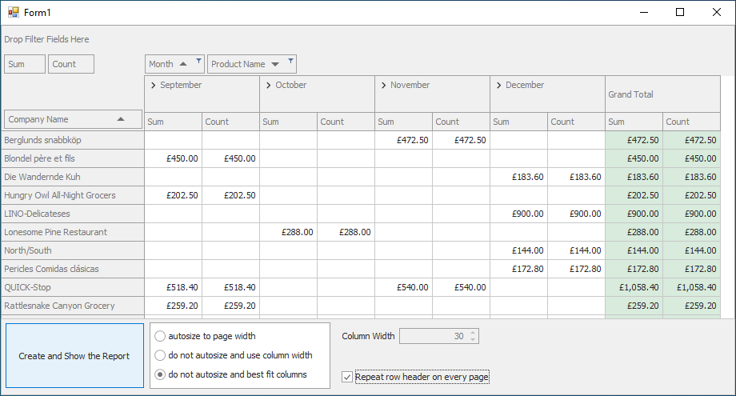

<!-- default badges list -->

<!-- default badges end -->
# Pivot Grid for WinForms - How to Create a Custom Exporter for PivotGridControl with the XtraReport Suite

This example illustrates how to create a custom report dynamically based on the [PivotGridControl](https://docs.devexpress.com/WindowsForms/DevExpress.XtraPivotGrid.PivotGridControl) content. This exporter supports the AutoRowHeight, BestFit, and FitToPage features.

This example also implements the scenarios introduced in the following suggestions:

- [Support Word Wrap When Printing and Exporting](https://www.devexpress.com/Support/Center/p/S130430) 

- [Use a Line Color When Printing](https://www.devexpress.com/Support/Center/p/S91257)

- [Print Row Headers on Every Page When Exporting/Printing](https://www.devexpress.com/Support/Center/p/AS9011)

- [Add an Event that Supplies a Custom Size for Field Values](https://www.devexpress.com/Support/Center/p/S18650)

## Files to Review
* [Form1.cs](./CS/Report_at_Runtime/Form1.cs) (VB: [Form1.vb](./VB/Report_at_Runtime/Form1.vb))
* [PivotReportGenerator.cs](./CS/Report_at_Runtime/PivotReportGenerator.cs) (VB: [PivotReportGenerator.vb](./VB/Report_at_Runtime/PivotReportGenerator.vb))
* [Program.cs](./CS/Report_at_Runtime/Program.cs) (VB: [Program.vb](./VB/Report_at_Runtime/Program.vb))

## More Examples

- [Pivot Grid for Web Forms - How to create a custom exporter using XtraReport](https://github.com/DevExpress-Examples/how-to-create-a-custom-exporter-using-xtrareport-autorowheight-bestfit-and-fittopage-e2686)

<!-- feedback -->
## Does this example address your development requirements/objectives?

 

(you will be redirected to DevExpress.com to submit your response)
<!-- feedback end -->
